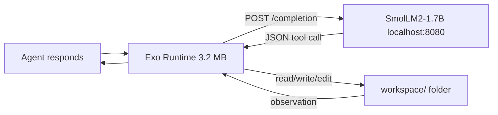

# Exo Runtime

A local AI coding agent that runs on a low end desktop with 8GB RAM and a mechanical hard drive.

## What Is This?

Exo Runtime lets a small AI model (SmolLM2-1.7B) safely read, write, edit, and search files in a workspace directory on your machine — without an internet connection, without a GPU, and without Python. It runs entirely offline on Linux Mint XFCE.

This is not a framework or a library. It is a single Rust binary (~3.2 MB) that talks to a local `llama.cpp` server and gives the model bounded, sandboxed access to your filesystem.

## What This Project Covers

The complete engineering document (`approach.md`) covers every step of the deployment — not just the Rust code, but the entire Linux system:

### System Tuning for HDD Performance
- **sysctl tuning:** swappiness=10, dirty ratio, vfs cache pressure — minimizes disk thrashing on a mechanical drive
- **I/O scheduler:** BFQ for fair queuing on HDD
- **CPU governor:** `performance` mode locked at boot via systemd service
- **Filesystem:** `noatime`, `commit=120` in fstab — defers and batches writes
- **Swap strategy:** 8 GB swapfile on outer HDD tracks + 1 GB zram (compressed RAM swap)

### llama.cpp Server Configuration
- `llama-server` runs as a systemd service (`llama-server.service`)
- **Flags:** `--no-mmap` (no page-in latency on HDD), `--mlock` (lock model in RAM), `--threads 4`, `--temp 0.1`
- **Model:** SmolLM2-1.7B-Instruct-Q8_0.gguf (~1.82 GB, fits in 8GB RAM alongside OS)
- Startup health check ensures the server is ready before the runtime connects

### Security Hardening (4 Layers of Defense)
- **Code level:** Traversal-safe path validator rejects `..` components, resolves symlinks
- **AppArmor profiles:** Both `exo-runtime` and `llama-server` are confined — restricted file access, localhost-only network, no capabilities
- **nftables firewall:** Port 8080 accessible from localhost only. Rate-limited logging to prevent flood
- **Filesystem hardening:** Workspace is a bind mount with `noexec,nosuid,nodev`. Disk quota limits at 500 MB soft / 1 GB hard

### Production Runbook
- `start-exo.sh` / `stop-exo.sh` scripts for graceful startup and shutdown
- Logrotate config for log management
- Monitoring dashboard via `watch`
- Passwordless sudo for the `exo` user (limited to specific `systemctl` commands)

## How It Works

The model outputs a JSON object like `{"tool":"read_file","data":"test.txt"}`. The runtime extracts it, validates the path, executes the tool via pure `std::fs`, and feeds the result back to the model. No shell commands are ever executed.

## Tools the Agent Can Use

| Tool | What It Does | Limit |
|------|-------------|-------|
| `read_file` | Read a file's contents | 256 KB |
| `write_file` | Create or overwrite a file | 1 MB |
| `edit_file` | Replace one piece of text in a file | Bounded |
| `grep_file` | Search for text in a file | 50 matches |
| `list_dir` | List files in a directory | 100 entries |
| `create_directory` | Create a folder | Recursive |
| `delete_file` | Delete a file | Single file |

## Resource Budget

| Component | RAM |
|-----------|-----|
| OS (Mint XFCE, idle) | ~400-500 MB |
| llama-server (Q8_0, 2048 ctx) | ~2.8-3.2 GB |
| exo-runtime | ~5-10 MB |
| **Total** | **~3.3-3.7 GB** |

Leaves ~4+ GB headroom for browser, terminal, and swap cache.

## Files in This Repository

| File | What's In It |
|------|-------------|
| `approach.md` | Complete engineering document (~2360 lines). Full Rust source code, system tuning, llama.cpp config, security hardening, runbook, Mermaid diagrams, testing strategy, and checklist. |
| `exo-runtime-blueprint.md` | High-level architecture overview, design decisions, failure modes, and system philosophy. No code. |
| `response.md` | Early critique of the original blueprint that shaped the final design. |

## Quick Start

1. Install Rust: `curl --proto '=https' --tlsv1.2 -sSf https://sh.rustup.rs | sh`
2. Build: `RUSTFLAGS="-C target-cpu=native" cargo build --release`
3. Set up llama.cpp with SmolLM2-1.7B Q8_0 model
4. Apply system tuning: sysctl, governor, BFQ, fstab (see `approach.md` Section 3)
5. Install `llama-server.service` systemd unit (Section 4)
6. Apply AppArmor profiles + nftables + bind mount + quota (Section 6)
7. Run: `/usr/local/bin/start-exo.sh`

See `approach.md` Sections 3-7 for the complete step-by-step guide.

## Target Hardware

- **CPU:** Intel i5 6th gen (or any x86-64 with AVX2)
- **RAM:** 8 GB (DDR3 or DDR4)
- **Storage:** Mechanical HDD (SATA, any speed)
- **OS:** Linux Mint XFCE (or any Linux with systemd, AppArmor, and nftables)
